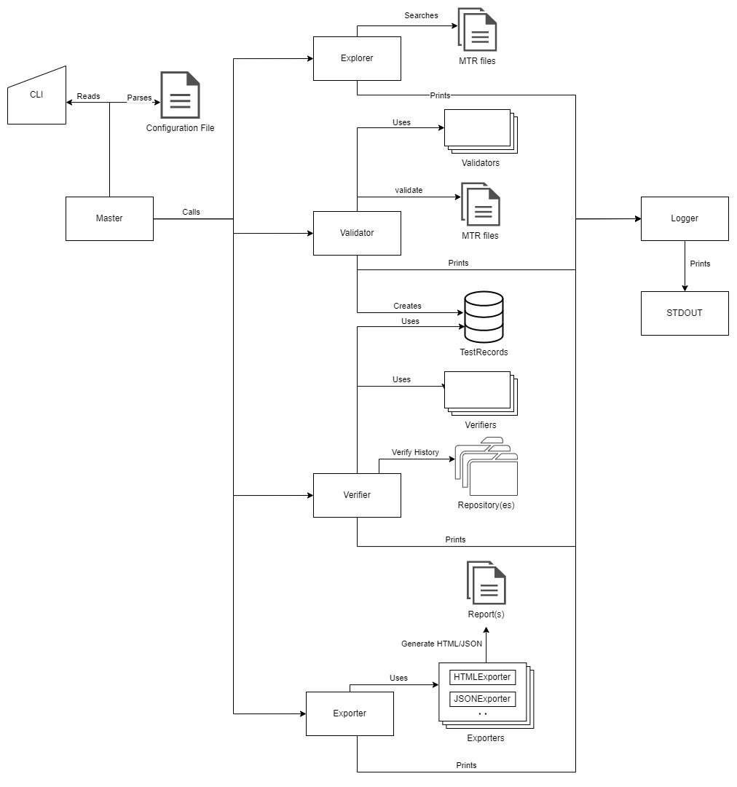

.. _`architecture-overview`:

Architecture
============

The following diagram offers an overview of all the interactions between the main tool classes:

Dragnet
-------

``Dragnet`` is the main module that includes all the classes.

Master
------

``Master`` is the entry point class for the Dragnet CLI, includes all the commands and
sub-commands of the CLI. The class structure uses helpers to perform the Use-cases steps.
:ref:`use case diagram <use-cases>`

Base
----

``Base`` is the base class for all CLI classes.

Logger
------

``Logger`` class is a logger for the CLI. It uses the ``say`` method in Thor's ``Shell`` class to print the messages to
the output, honoring the status of the ``quiet`` command line switch.

Explorer
--------
The ``Explorer`` class' purpose is to search for Manual Test Record files inside a given path by using the given Glob
patterns.

The class performs the search for MTR files and returns an array with the found files.

Validator
---------

The ``Validator`` class' purpose is to validate a set of Manual Test Record files content.
Every MTR must be readable, have a valid YAML syntax, have the expected keys and those keys should have sensible
values.

Validators
^^^^^^^^^^

The ``Validators`` module is a namespace for ``Validator`` classes.
The classes contained in the ``Validators`` module are support classes for the validate phase.
:ref:`use case diagram <use-cases>`

Verifier
--------

The ``Verifier`` class executes the verification process on the given Test Records. Runs the verify process
and returns, for each Test Record, the result of the verification process.

Verifiers
^^^^^^^^^

The ``Verifiers`` module is a namespace for ``Verifier`` classes.
The classes contained in ``Verifiers`` module are support classes for the verify phase.
:ref:`use case diagram <use-cases>`

Exporter
--------

The ``Exporter`` class' objective is to export the results to specified file.
The class receives an array of test records, an array of errors and an array of file names and exports the results
to the given files deducing the format from file names.

Exporters
^^^^^^^^^

The ``Exporters`` module is a namespace for the ``Exporter`` classes.
The classes contained in ``Exporters`` module are support classes for the export phase.
:ref:`use case diagram <use-cases>`

BaseRepository
--------------

The ``BaseRepository`` class is the base class for Dragnet's repository classes.

Repository
----------

The ``Repository`` class is a small wrapper around a Git Repository object. It provides some useful methods needed
during the verify process as well as for reporting.

MultiRepository
---------------

The ``MultiRepository`` class is a dummy class that acts as a placeholder when Dragnet is executed on a multi-repo
set-up.

Since there is no Git repository in the directory where git-repo runs git commands cannot be executed there only in
the inner repositories.

This class's job is to raise a particular error when a git operation is attempted directly on this directory so that
Dragnet can recognize the cause of the error and display it correctly.

It also acts as a collection of repositories. It stores a collection of ``Dragnet::Repository`` objects, which point to
the actual repositories.

Repo
----

The ``Repo`` class represents a repository, for MTRs which reference multiple repositories in a multi-repo project,
often managed with git-repo.

RepositoryHelper
----------------

The ``RepositoryHelper`` class contains some helper methods to use when working with repositories.

Error
-----

The ``Error`` class is the base class for all errors raised by the gem.

Errors
^^^^^^

The ``Errors`` module contains all the errors classes that the gem raises.

Version
-------

The ``Version`` contains information about the tool version.
