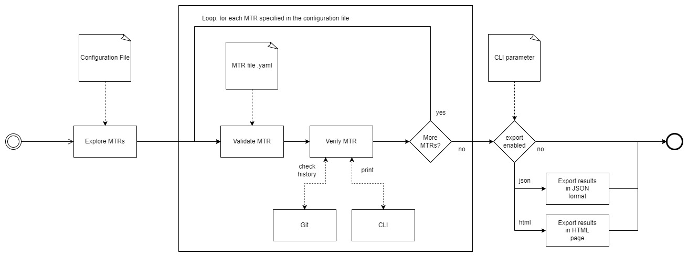

Use Cases
=========

Dragnet allows the validation of Manual Test Records against the changes in the repository between the revision listed
in the MTR and the current commit.

The gem has to be configured and uses git to detect changes in target files.

The Dragnet use-case can be described as a set of phases:

1. ``Explore``: the gem searches for all the MTRs file given in the Configuration file.
2. ``Validate``: the gem validates the informations contained in each MTR file.
3. ``Verify``: the gem checks in the target repository if there are any changes to the repository or the files listed
   in the MTRs since the specified commit.
4. ``Export``: if enabled, the gem exports the results to JSON or HTML format.

.. _`use-cases`:

Diagram:
++++++++

Explore
+++++++

The gem analyses the Configuration file and lists all the MTR files.

If the configuration file has missing or malformed parameters an error is raised.

Validate
++++++++

The gem validates each of the MTRs from the ``Explore`` phase, if the files are not comnplete or
malformed an error is raised.

Verify
++++++

The gem checks for each valid MTR file the history of the repository or the specified files using ``git`` in the target
repository. The gem then print in CLI the results of the checks to the user.

Export
++++++

If the gem is configured via CLI parameter to export the ``Verify`` phase results, a report is created in
JSON format or via HTML navigable page.