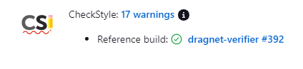
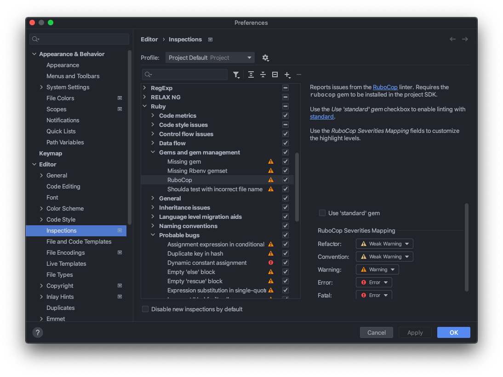
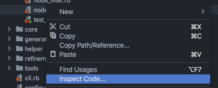
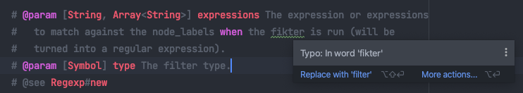
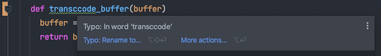

Coding Style
============

Please be sure to follow the following code-style guidelines when developing
inside the tool.

Style-Guide
-----------

Dragnet is following `RuboCop's Style Guide`_ and
`RuboCop's style guide for RSpec`_

Make sure your code follows the principles and practices outlined in those
guides.

RuboCop
+++++++

.. image:: images/rubocop-logo.png
   :align: center

The project is using RuboCop_ as an inspector / static analysis tool. Dragnet
Unit Tests job is configured to run RuboCop on every patchset and present a
report with the findings:

RuboCop's Configuration
~~~~~~~~~~~~~~~~~~~~~~~

The Configuration for RubCop is stored in the following files:

/.rubocop.yml
  Linter configuration for Dragnet core classes.

Configure the Linter in your IDE
~~~~~~~~~~~~~~~~~~~~~~~~~~~~~~~~

The best would be to configure your IDE to run RuboCop by default as you write
code, this way you'd be able to see the issues as you write the code and you'll
have to do less changes during code-review.

To enable RuboCop in RubyMine follow these steps:

1. Open RubyMine's preferences (``⌘+,`` on mac)
2. Go to **Editor** -> **Inspections**
3. Scroll down to **Ruby** and inside select **Gems and gems management**
4. Make sure the checkbox to the right of **RuboCop** is ticked.
5. (Optional) Adjust the warning types and colors so that you can clearly see the
   warnings in your code.

Running RuboCop explicitly
~~~~~~~~~~~~~~~~~~~~~~~~~~

You can run RuboCop explicitly on a file by right clicking on it and selecting
**Inspect Code** from the menu:

Optionally you can run RuboCop from the command line with::

  $ bundle exec rubocop

Typos and Spelling Mistakes
~~~~~~~~~~~~~~~~~~~~~~~~~~~

Writing good code is not only about following the Style Guide's rule or getting
rid of the Linter's warnings. You should also be in the lookout for typos and
spelling mistakes. RubyMine offers spell checking for comments, and strings:

The same feature can detect typos in code:

Use this tool to improve the quality of your code and documentation.

  "If we are not able to take care about the typos, how can we then take care
  about the quality of our test cases!?"

  Julian Schneider, 2018 Testers Paradise

.. _RuboCop: https://github.com/rubocop/rubocop
.. _RuboCop's Style Guide: https://github.com/rubocop/ruby-style-guide/blob/master/README.adoc
.. _RuboCop's style guide for RSpec: https://github.com/rubocop/rspec-style-guide

